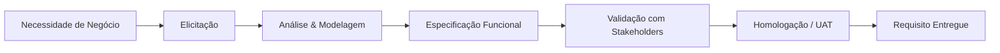

# 📖 1. O que é Análise Funcional

## Definição

**Análise Funcional** (ou Análise de Negócio, conforme o **BABOK v3** do IIBA) é a disciplina que **traduz necessidades de negócio em requisitos claros, testáveis e implementáveis**, servindo de **ponte entre stakeholders (áreas de negócio) e o time técnico (desenvolvimento, QA, arquitetura)**.

O Analista Funcional (AF) não escreve código — mas escreve os **artefatos que permitem que o código seja escrito corretamente na primeira vez**.

---

## Por que existe?

Sem análise funcional, um projeto costuma sofrer de:

| Sintoma | Custo |
| :--- | :--- |
| Requisito ambíguo | Retrabalho de desenvolvimento |
| Regra de negócio implícita na cabeça de um único usuário | Bug em produção |
| Escopo mal delimitado | Estouro de prazo e orçamento |
| Falta de rastreabilidade requisito → teste | Falha na homologação |

> 📊 **Estudo Standish Group (CHAOS Report):** requisitos mal definidos são responsáveis por **~37% das falhas de projetos de software**.

---

## O que a Análise Funcional entrega?

**Principais artefatos:**
- 📄 **BRD** — Business Requirements Document (o *porquê*)
- 📄 **FRD** — Functional Requirements Document (o *o quê*)
- 📄 **SRS** — Software Requirements Specification (o *como*)
- 📄 **User Stories** — em contexto ágil
- 📄 **Casos de Uso** — em contexto tradicional/UML
- 📄 **Regras de Negócio** — políticas e restrições
- 📄 **RTM** — Matriz de Rastreabilidade Requisito → Teste

---

## Análise Funcional × Análise de Sistemas × Análise de Negócio

| Aspecto | Análise de Negócio (BA) | Análise Funcional (AF) | Análise de Sistemas (AS) |
| :--- | :--- | :--- | :--- |
| **Foco** | Problema de negócio | Comportamento do software | Arquitetura técnica |
| **Pergunta-chave** | Por quê? | O quê? | Como? |
| **Entregável típico** | BRD, business case | FRD, user story, caso de uso | Diagrama de componentes, DER |
| **Interlocutor** | Sponsor, PO, diretoria | Usuário-chave, PO, dev | Arquiteto, dev sênior |

> 💡 Na prática brasileira, os três papéis frequentemente se misturam em um único profissional chamado **"Analista Funcional Sênior"** — que é o perfil documentado neste repositório.

---

## Contextos de aplicação

- ✅ **Waterfall / PMBOK:** BRD → FRD → SRS → Homologação (documentação extensa, aprovação formal)
- ✅ **Ágil / Scrum:** Épicos → Features → User Stories → Refinement → Sprint Review
- ✅ **Híbrido (mais comum):** governança de PMBOK + entrega em sprints
- ✅ **Sustentação:** Change Requests + Regras de Negócio + Runbooks

---

## Próximo passo

👉 [02 — Papel do Analista Funcional](02-papel-do-analista-funcional.md)
