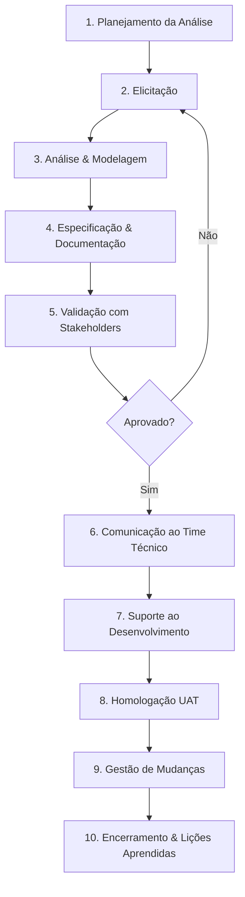
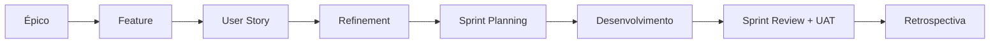

# 🔄 3. Ciclo de vida da Análise Funcional

## Visão macro (BABOK v3 adaptado)

---

## Detalhamento de cada fase

### 1. Planejamento da Análise
- Definir stakeholders (Matriz RACI)
- Escolher técnicas de elicitação
- Definir templates e ferramentas
- **Artefato:** Plano de Análise de Negócio

### 2. Elicitação
- **Técnicas:** Entrevista, Workshop, Observação (job shadowing), Análise documental, Prototipação, Brainstorming
- **Artefato:** Ata + rascunho de requisitos

### 3. Análise & Modelagem
- Organizar requisitos por tema/módulo
- Modelar processos (BPMN), fluxos, dados
- Identificar regras de negócio e restrições
- **Artefato:** Diagramas + catálogo de regras

### 4. Especificação & Documentação
- **Waterfall:** BRD → FRD → SRS
- **Ágil:** Épico → Feature → User Story com critérios de aceite
- **Artefato:** Documento funcional formal

### 5. Validação
- Revisão com stakeholders (walkthrough)
- Ajustes conforme feedback
- **Artefato:** Documento aprovado + sign-off

### 6. Comunicação ao Time Técnico
- Kick-off técnico
- Esclarecimento de dúvidas
- **Artefato:** Ata técnica

### 7. Suporte ao Desenvolvimento
- Refinamento (grooming) contínuo
- Esclarecer regras durante a codificação
- **Artefato:** Comentários no Jira

### 8. Homologação (UAT)
- Preparar cenários de teste
- Conduzir sessão com key user
- **Artefato:** Checklist UAT + termo de aceite

### 9. Gestão de Mudanças
- Avaliar impacto (escopo, prazo, custo)
- Formalizar via Change Request
- **Artefato:** CR aprovado

### 10. Encerramento
- Lessons learned
- Atualizar templates e RTM final
- **Artefato:** Post-mortem funcional

---

## Ciclo em contexto ágil (Scrum)

O AF atua principalmente entre **Épico → Feature → US → Refinement** e depois em **UAT**.

---

## Próximo passo

👉 [04 — Glossário](04-glossario.md)
