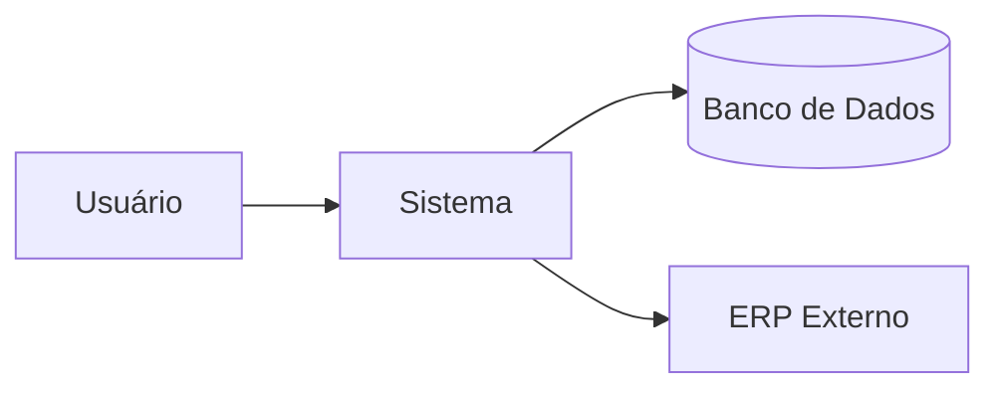
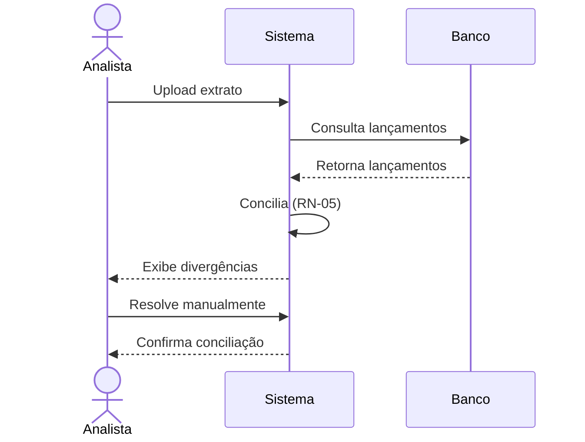

# 📄 FRD — Functional Requirements Document

> **Objetivo:** documentar **O QUÊ** o sistema deve fazer. Deriva do BRD e alimenta o SRS/desenvolvimento.

---

## 1. Identificação
| Campo | Valor |
| :--- | :--- |
| Projeto | `<Nome>` |
| BRD relacionado | `PRJ-YYYY-NNN` |
| Versão | 1.0 |
| Autor | `<AF>` |
| Data | DD/MM/YYYY |

---

## 2. Visão Geral do Sistema

`<Parágrafo descritivo do que o sistema fará em alto nível.>`

**Diagrama de contexto:**

---

## 3. Atores

| Ator | Descrição | Permissões |
| :--- | :--- | :--- |
| Analista Financeiro | Executa conciliação | Ler/Executar |
| Gestor | Aprova divergências | Aprovar |
| Auditor | Consulta trilhas | Somente leitura |

---

## 4. Requisitos Funcionais

> **Convenção de ID:** `RF-<módulo>-<sequencial>` — ex.: `RF-CON-001`

| ID | Descrição | Prioridade (MoSCoW) | Origem |
| :--- | :--- | :--- | :--- |
| RF-CON-001 | O sistema deve importar extratos bancários em formato OFX, CSV e CNAB240. | Must | Entrevista Key User 12/03 |
| RF-CON-002 | O sistema deve conciliar automaticamente lançamentos por valor + data ± 3 dias. | Must | RN-05 |
| RF-CON-003 | O sistema deve permitir conciliação manual de divergências. | Must | Workshop 15/03 |
| RF-CON-004 | O sistema deve exportar relatório de divergências em PDF e Excel. | Should | Sponsor |
| RF-CON-005 | O sistema deve enviar e-mail ao gestor quando divergência > R$ 10.000. | Could | Gestor |

---

## 5. Requisitos Não-Funcionais (NFR)

| ID | Categoria | Descrição | Métrica |
| :--- | :--- | :--- | :--- |
| NFR-01 | Performance | Importar arquivo de 100k linhas | < 60s |
| NFR-02 | Disponibilidade | Uptime | 99,5% |
| NFR-03 | Segurança | Autenticação | SSO Azure AD |
| NFR-04 | Auditoria | Trilha de todas as alterações | Retenção 5 anos |
| NFR-05 | Usabilidade | Curva de aprendizado | Key user autônomo em 2h |

---

## 6. Regras de Negócio (resumo)

Ver documento completo em [`06-regra-de-negocio.md`](06-regra-de-negocio.md).

| ID | Regra | Requisito |
| :--- | :--- | :--- |
| RN-05 | Tolerância de data ± 3 dias úteis | RF-CON-002 |
| RN-08 | Divergência > R$ 10k requer aprovação dupla | RF-CON-005 |

---

## 7. Interfaces com outros sistemas

| Sistema | Direção | Protocolo | Frequência |
| :--- | :--- | :--- | :--- |
| SAP | Entrada | SFTP + arquivo TXT | Diária 23h |
| Banco X | Entrada | API REST OAuth 2.0 | On-demand |
| E-mail corporativo | Saída | SMTP | Evento |

---

## 8. Fluxo Principal (macro)

---

## 9. Critérios de Aceite Gerais

- ✅ 100% dos RF "Must" implementados e testados
- ✅ Sign-off do key user em cada módulo
- ✅ Cobertura de teste automatizado ≥ 80%
- ✅ Documentação de operação (runbook) entregue

---

## 10. Aprovação

| Papel | Nome | Data |
| :--- | :--- | :--- |
| Sponsor | | |
| Key User | | |
| Arquiteto | | |
