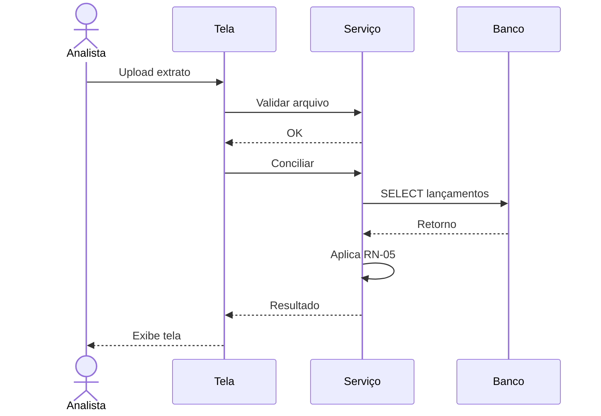

# 📄 Caso de Uso (UML) — Template

## UC-XXX — `<Nome do Caso de Uso>`

| Campo | Valor |
| :--- | :--- |
| **ID** | UC-XXX |
| **Ator principal** | `<Nome do ator>` |
| **Atores secundários** | `<...>` |
| **Objetivo** | `<O que o ator quer alcançar>` |
| **Pré-condições** | `<Estado antes do UC>` |
| **Pós-condições (sucesso)** | `<Estado após sucesso>` |
| **Pós-condições (falha)** | `<Estado após falha>` |
| **Gatilho** | `<Evento que inicia o UC>` |
| **Prioridade** | Alta / Média / Baixa |
| **Frequência** | `<X vezes/dia>` |

---

### Fluxo Principal (Happy Path)

| # | Ator | Ação |
| :--- | :--- | :--- |
| 1 | Analista | Acessa tela de conciliação |
| 2 | Sistema | Exibe lista de lançamentos pendentes |
| 3 | Analista | Faz upload do extrato bancário |
| 4 | Sistema | Valida formato do arquivo (**RN-01**) |
| 5 | Sistema | Executa conciliação automática (**RN-05**) |
| 6 | Sistema | Exibe resultado: conciliados × divergências |
| 7 | Analista | Confirma conciliação |
| 8 | Sistema | Grava trilha de auditoria (**NFR-04**) |

---

### Fluxos Alternativos

**FA-01 — Arquivo em formato inválido (após passo 4)**
- 4a. Sistema exibe erro "Formato não suportado"
- 4b. Retorna ao passo 3

**FA-02 — Nenhuma correspondência encontrada (após passo 5)**
- 5a. Sistema marca todos como divergência
- 5b. Redireciona para tela de conciliação manual (UC-YYY)

---

### Fluxos de Exceção

**FE-01 — Timeout na consulta ao ERP**
- Sistema exibe "Serviço indisponível, tente novamente"
- Registra log de erro
- Envia alerta ao suporte

---

### Diagrama de Sequência (Mermaid)

---

### Regras de Negócio referenciadas
- RN-01, RN-05, NFR-04

### Requisitos Funcionais referenciados
- RF-CON-001, RF-CON-002
