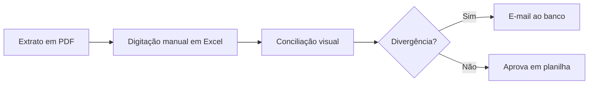
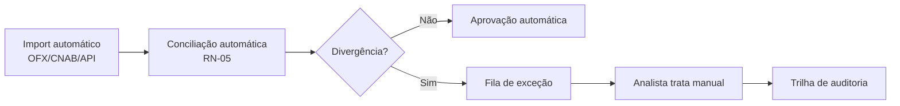

# 📄 GAP Analysis — As-Is × To-Be

> **Objetivo:** comparar o **processo atual (As-Is)** com o **processo desejado (To-Be)** e identificar as **lacunas (gaps)** a serem endereçadas pelo projeto.

---

## 1. Contexto

| Campo | Valor |
| :--- | :--- |
| Processo | `<Nome do processo>` |
| Área | `<Área responsável>` |
| Data análise | DD/MM/YYYY |
| Analista | `<AF>` |

---

## 2. Processo AS-IS (atual)

### 2.1 Diagrama


### 2.2 Descrição
- Tempo médio: **6 horas/dia por analista**
- Envolvidos: 3 pessoas
- Erros: ~8% dos lançamentos

### 2.3 Dores identificadas
- 🔴 Alto retrabalho manual
- 🔴 Falta de trilha de auditoria
- 🔴 Baixa escalabilidade

---

## 3. Processo TO-BE (desejado)

### 3.1 Diagrama


### 3.2 Descrição
- Tempo médio: **30 min/dia por analista**
- Envolvidos: 1 pessoa
- Erros: < 2%

---

## 4. Matriz de GAPs

| # | Área | AS-IS | TO-BE | GAP | Ação | Responsável | Prazo |
| :--- | :--- | :--- | :--- | :--- | :--- | :--- | :--- |
| G-01 | Entrada de dados | Digitação manual PDF | Import automático OFX/CNAB | Sistema não tem parser | Desenvolver módulo import | Dev | S3 |
| G-02 | Conciliação | Visual em Excel | Regra automática RN-05 | Motor de regras | Implementar engine | Dev | S5 |
| G-03 | Auditoria | Nenhuma | Trilha 5 anos | Ausência de logs | Adicionar audit log | Arquitetura | S6 |
| G-04 | Capacitação | Excel avançado | Novo sistema | Treinamento | Plano de treinamento | RH + AF | S10 |

---

## 5. Priorização (matriz Impacto × Esforço)

```
Alto  |  G-03      | G-01, G-02
      |------------+------------
Baixo |  G-04      |
      |____________|__________
       Baixo         Alto  ← Impacto no negócio
       ↑ Esforço
```

**Fazer primeiro:** G-01 e G-02 (alto impacto, alto esforço mas críticos)
**Quick win:** G-03 (baixo esforço, alto impacto)
