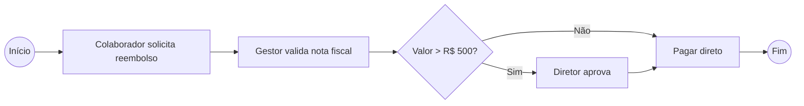
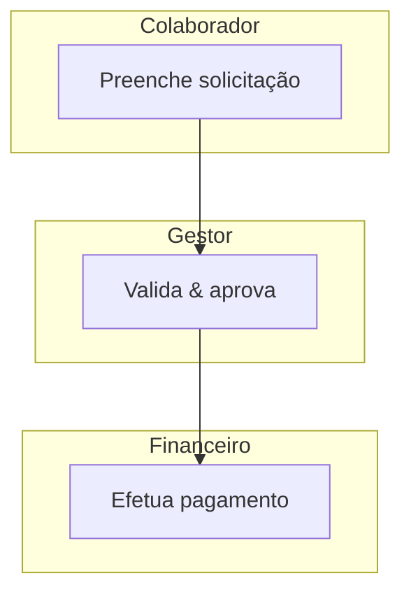

# 📊 BPMN — Notação e Exemplos

> BPMN 2.0 (Business Process Model and Notation) é o padrão **OMG** para modelar processos de negócio de forma legível por negócio e técnico.

## Elementos básicos (em Mermaid — aproximação)

| Elemento BPMN | Símbolo | Uso |
| :--- | :--- | :--- |
| Evento início | ⭕ | Início do processo |
| Atividade | ▭ | Tarefa a ser executada |
| Gateway (decisão) | 🔷 | Ponto de decisão |
| Evento fim | 🔴 | Fim do processo |

## Exemplo — Processo de aprovação de despesa

## Exemplo com raia (swimlane conceitual)

## Boas práticas
- Nome de atividade sempre começa com **verbo no infinitivo** (Aprovar, Enviar).
- Todo gateway deve ter **saída de sim/não claramente rotulada**.
- Um processo tem **1 início e ao menos 1 fim** (pode ter múltiplos fins).
- Se o processo tem mais de 20 atividades, quebre em subprocessos.
