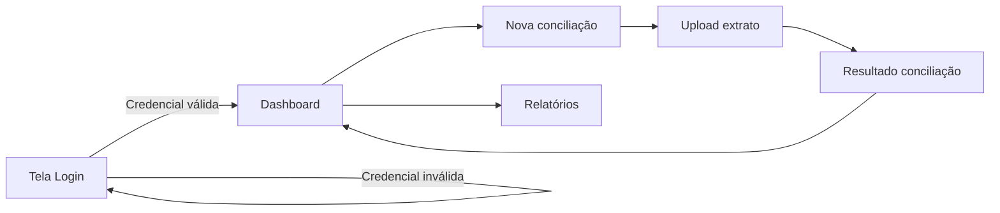

# 📊 Fluxo de Tela / Navegação

Modela como o usuário navega entre telas do sistema.

## Exemplo — Fluxo de login e dashboard

## Como usar em documentação
1. Cada nó = **1 tela real**
2. Rótulo da seta = **ação do usuário** ou **condição**
3. Vincule cada tela a um **wireframe/Figma** em anexo
