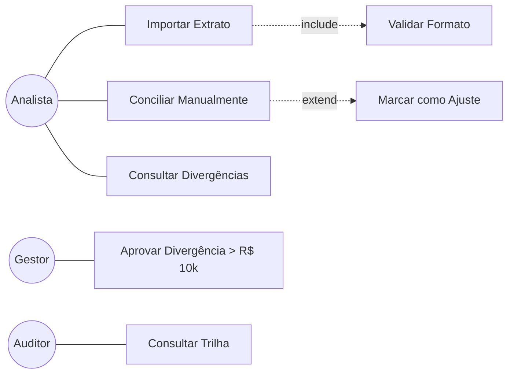

# 📊 Diagrama de Casos de Uso (UML)

## Exemplo — Sistema de Conciliação

## Convenções
- **Ator** — círculo com nome
- **UC** — retângulo com verbo no infinitivo
- **Include** — UC obrigatoriamente executa outro
- **Extend** — UC pode opcionalmente executar outro
