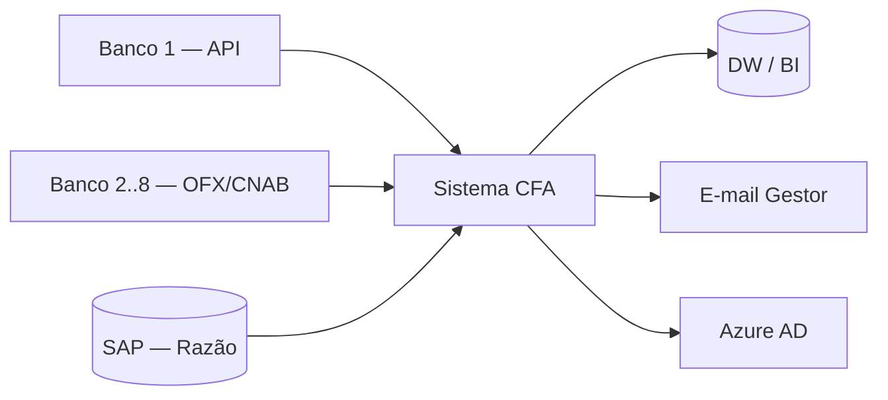
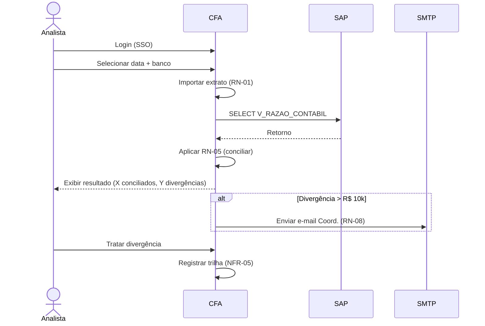

# 📄 FRD — Sistema de Conciliação Financeira Automatizada

## 1. Identificação
| Campo | Valor |
| :--- | :--- |
| Projeto | CFA — PRJ-2025-014 |
| BRD relacionado | PRJ-2025-014 v1.2 |
| Versão | 2.0 |
| Autor | Everton P. Santos |
| Data | 05/04/2025 |

## 2. Visão Geral

O CFA é um sistema web interno que **importa extratos bancários automaticamente**, cruza com o razão contábil do SAP aplicando **regras de tolerância**, e apresenta uma **tela de tratamento de divergências** com trilha de auditoria SOX-compliant.

### Diagrama de contexto

## 3. Atores

| Ator | Descrição | Permissões |
| :--- | :--- | :--- |
| Analista Contábil | Executa conciliação diária | Ler, Executar, Tratar divergência |
| Coordenador | Aprova divergências > R$ 10k | Aprovar |
| Diretor Financeiro | Aprova > R$ 100k | Aprovar |
| Auditor (KPMG) | Consulta trilhas | Somente leitura |
| Administrador | Configura regras, bancos, usuários | Total |

## 4. Requisitos Funcionais

| ID | Descrição | MoSCoW | Origem |
| :--- | :--- | :--- | :--- |
| RF-CON-001 | Importar extratos nos formatos OFX, CSV e CNAB240 via upload manual | Must | Entrevista Ana 12/03 |
| RF-CON-002 | Importar extratos via API REST do Banco 1 (OAuth 2.0) | Must | Workshop 15/03 |
| RF-CON-003 | Aplicar conciliação automática por valor + data ± 3 dias úteis (RN-05) | Must | RN-05 |
| RF-CON-004 | Tela de tratamento manual de divergências com marcação (ajuste, estorno, pendente) | Must | Workshop 15/03 |
| RF-CON-005 | Alerta e-mail ao Coord. quando divergência > R$ 10k (RN-08) | Must | RN-08 |
| RF-CON-006 | Alerta e-mail ao Diretor quando > R$ 100k | Should | Sponsor |
| RF-CON-007 | Gerar relatório de conciliação em PDF e Excel | Must | Sponsor |
| RF-CON-008 | Trilha de auditoria imutável, retenção 5 anos (RN-12) | Must | KPMG/SOX |
| RF-CON-009 | Dashboard com KPIs (% conciliado, tempo médio, divergências pendentes) | Should | Sponsor |
| RF-CON-010 | Configurador de regras (adm) — parametrizar tolerância, banco, período | Should | Arquiteto |
| RF-CON-011 | SSO via Azure AD | Must | TI |
| RF-CON-012 | Export das trilhas em formato compatível SOX (CSV assinado) | Must | KPMG |

## 5. Requisitos Não-Funcionais

| ID | Categoria | Descrição | Métrica |
| :--- | :--- | :--- | :--- |
| NFR-01 | Performance | Importar arquivo 100k linhas | < 60 s |
| NFR-02 | Performance | Conciliar 100k lançamentos | < 5 min |
| NFR-03 | Disponibilidade | Uptime horário comercial | 99,5% |
| NFR-04 | Segurança | Autenticação SSO Azure AD + MFA | Obrigatório |
| NFR-05 | Auditoria | Log imutável de toda alteração | Retenção 5 anos |
| NFR-06 | Usabilidade | Key user autônomo | ≤ 2h de treinamento |
| NFR-07 | Compliance | LGPD + SOX 404 | Auditado por KPMG |
| NFR-08 | Backup | RTO / RPO | 4h / 1h |

## 6. Regras de Negócio (referência)

Ver detalhamento em [`05-regras-de-negocio.md`](05-regras-de-negocio.md).

| ID | Regra | RF |
| :--- | :--- | :--- |
| RN-01 | Formatos aceitos: OFX, CSV, CNAB240 | RF-CON-001 |
| RN-02 | Perfis: Analista, Coord., Diretor, Auditor, Admin | RF-CON-011 |
| RN-05 | Tolerância valor 0% + data ±3 dias úteis | RF-CON-003 |
| RN-08 | Divergência > R$ 10k requer aprovação Coord. | RF-CON-005 |
| RN-09 | Divergência > R$ 100k requer aprovação Diretor | RF-CON-006 |
| RN-12 | Retenção trilha 5 anos, imutável | RF-CON-008 |
| RN-15 | Nenhum usuário pode aprovar sua própria divergência | RF-CON-004 |

## 7. Interfaces

| Sistema | Direção | Protocolo | Frequência |
| :--- | :--- | :--- | :--- |
| Banco 1 | Entrada | API REST OAuth 2.0 | On-demand |
| Bancos 2–8 | Entrada | SFTP + arquivo OFX/CNAB | Diária 06h |
| SAP | Entrada | View Oracle `V_RAZAO_CONTABIL` | On-demand |
| Azure AD | Autenticação | SAML 2.0 | Login |
| SMTP corporativo | Saída | SMTP TLS | Evento |
| DW/BI | Saída | View / API JSON | Diária 23h |

## 8. Fluxo Principal (macro)

## 9. Critérios de Aceite Gerais

- ✅ 100% dos RF "Must" implementados e homologados
- ✅ RTM 100% preenchida com sign-off
- ✅ Auditoria KPMG aprova trilha SOX
- ✅ Ana (key user) consegue conciliar 1 dia útil em < 30 min
- ✅ Testes automatizados ≥ 80% cobertura

## 10. Aprovações
| Papel | Nome | Data |
| :--- | :--- | :--- |
| Sponsor | Diretor Financeiro | 05/04/2025 |
| Key User | Ana (Contábil Sr.) | 05/04/2025 |
| Arquiteto | Time TI | 05/04/2025 |
| Auditoria | KPMG (representante) | 07/04/2025 |
