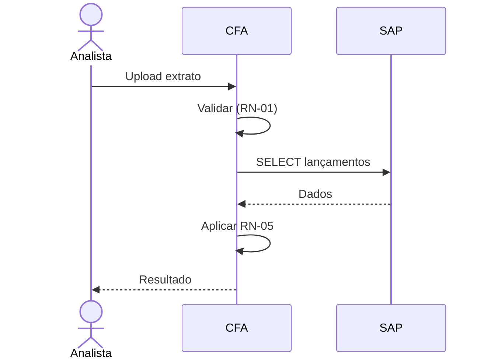
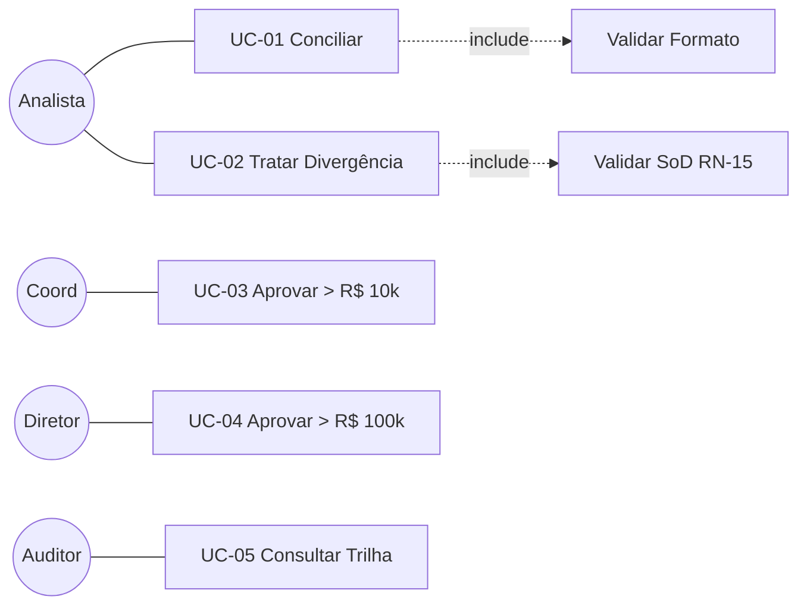

# 📄 Casos de Uso — Case Conciliação

## UC-01 — Executar Conciliação Automática

| Campo | Valor |
| :--- | :--- |
| Ator principal | Analista Contábil |
| Atores secundários | Sistema SAP |
| Objetivo | Conciliar lançamentos bancários com contábeis automaticamente |
| Pré-condições | Usuário autenticado; extrato disponível |
| Pós-cond. sucesso | Lançamentos marcados como conciliado ou divergência; trilha gerada |
| Pós-cond. falha | Sistema exibe erro; nenhuma alteração persistida |
| Gatilho | Analista clica "Conciliar" após upload |
| Prioridade | Alta |
| Frequência | 8x/dia por analista |

### Fluxo Principal
| # | Ator | Ação |
| :--- | :--- | :--- |
| 1 | Analista | Acessa "Nova Conciliação" |
| 2 | Sistema | Exibe seletor de banco + data |
| 3 | Analista | Faz upload do extrato |
| 4 | Sistema | Valida formato (RN-01) |
| 5 | Sistema | Consulta V_RAZAO_CONTABIL no SAP |
| 6 | Sistema | Aplica RN-05 (valor + data ±3 dias úteis) |
| 7 | Sistema | Exibe resultado (X conciliados, Y divergências) |
| 8 | Sistema | Grava trilha (NFR-05) |

### FA-01 — Arquivo inválido (após passo 4)
- 4a. Exibe "Formato não suportado"
- 4b. Retorna ao passo 3

### FE-01 — SAP indisponível (após passo 5)
- 5a. Exibe "Serviço SAP indisponível, tente em 5 min"
- 5b. Registra log crítico
- 5c. Não persiste nenhuma conciliação parcial

### Diagrama

---

## UC-02 — Tratar Divergência Manual

| Campo | Valor |
| :--- | :--- |
| Ator principal | Analista Contábil |
| Objetivo | Classificar divergência e aprovar/pendente |
| Pré-condições | UC-01 executado com divergências |

### Fluxo
1. Analista abre tela de divergências
2. Seleciona uma linha
3. Escolhe classificação (Ajuste / Estorno / Pendente)
4. Informa justificativa (mín. 20 chars — RN)
5. Sistema valida SoD (RN-15) — bloqueia se for própria criação
6. Sistema grava trilha
7. Se valor > R$ 10k → envia e-mail Coord. (RN-08)

---

## UC-03 — Aprovar Divergência (Coord/Diretor)

| Ator | Coord. Controladoria / Diretor Financeiro |

Ver US-104 e US-110.

---

## Diagrama consolidado de Casos de Uso

