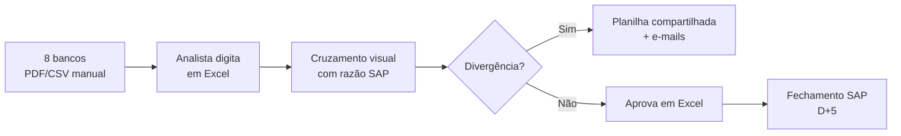
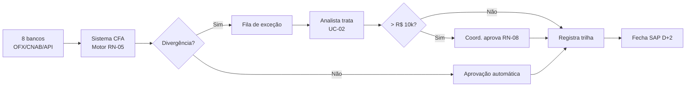

# 📄 GAP Analysis — Conciliação (As-Is × To-Be)

## AS-IS (atual)

**Métricas:** 18h/dia · 8% divergências · 5 dias fechamento · sem trilha

---

## TO-BE (desejado)

**Métricas alvo:** 3h/dia · <2% divergências · 2 dias fechamento · trilha SOX 5 anos

---

## Matriz de GAPs

| # | Área | AS-IS | TO-BE | GAP | Ação | Resp. | Prazo |
| :--- | :--- | :--- | :--- | :--- | :--- | :--- | :--- |
| G-01 | Entrada | Manual PDF/CSV | Automático OFX/CNAB/API | Sem parser | Dev módulo import | Dev | S5 |
| G-02 | Conciliação | Visual Excel | Motor RN-05 | Sem engine | Dev engine + config | Dev | S8 |
| G-03 | Governança | E-mails soltos | Fila + workflow aprovação | Sem workflow | Dev módulo aprovação | Dev | S10 |
| G-04 | Auditoria | Nenhuma | Trilha 5 anos imutável | Sem log | Implementar audit + WORM | Arq. | S9 |
| G-05 | Integração | Nenhuma | View SAP | View não existe | Solicitar DBA SAP | DBA | S3 |
| G-06 | Compliance | Risco SOX | SOX 404 ok | Sem evidência | Alinhar KPMG desde FRD | GP | S2 |
| G-07 | Pessoas | 3 analistas full | 1 analista part | Realocação | Plano gestão de mudança | RH+AF | S12 |
| G-08 | Métricas | Nenhuma | Dashboard KPIs | Sem BI | Publicar view no DW | BI | S11 |

## Priorização (Impacto × Esforço)

**Prioridade máxima (fazer nas primeiras sprints):** G-01, G-02, G-05
**Alto impacto, quick win:** G-06 (alinhar KPMG)
**Longo prazo:** G-07 (gestão de mudança)
